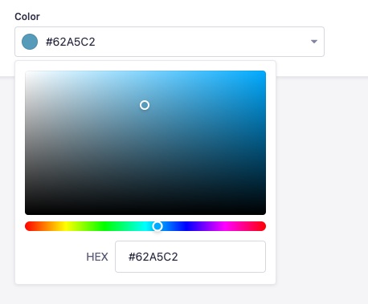

# Metrix plugin Color Picker

A Metrix-maintained color picker custom field.

## Installation

To install this plugin, you need to add an NPM dependency to your Metrix application:

```sh
# Using Yarn
yarn add @metrix/plugin-color-picker

# Or using NPM
npm install @metrix/plugin-color-picker
```

Then, you'll need to build your admin panel:

```sh
# Using Yarn
yarn build

# Or using NPM
npm run build
```

## Usage

Use saturation and hue sliders to select a color and save the value as a HEX string


